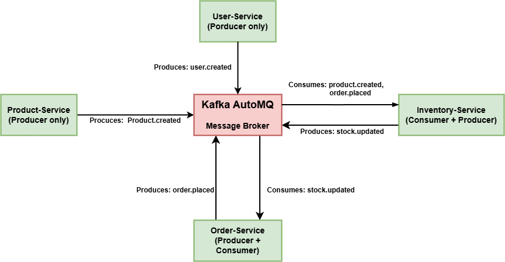

# E-commerce Microservices Testing Documentation

This documentation provides a comprehensive guide for testing the complete workflow of the integrated E-commerce Microservices system. With our product-inventory integration, creating products now automatically creates inventory records, simplifying the testing process.

## System Architecture


The architecture includes separate microservices for:

**User Service:** Handles user registration, authentication and profile management.

**Product Service:** Manages product creation, updates, and retrieval.

**Inventory Service:** Keeps track of product stock levels and availability.

**Order Service:** Manages order creation, processing, and tracking.

## Run the Application

Run the application using docker compose:

```bash
docker-compose up --build -d
```

This command builds and starts all microservices and their dependencies, such as databases.

## Install `jq`

Install `jq` to make JSON output more readable in the terminal:

```bash
apt-get update && apt-get install -y jq
```

## Overview of Testing Flow

1. User Registration and Authentication
2. Adding User Address
3. Creating Products (Inventory is automatically created)
4. Browsing Products and Checking Inventory
5. Placing Orders
6. Viewing Order Details

Each step is tested via REST API calls using curl, simulating realistic user actions.

Let's begin testing each component of the system.


# User_Service: 

## 1. User Registration and Authentication

First, we'll register a new user and obtain an authentication token.

### Step 1.1: Register a New User

```bash
curl -X POST "http://localhost/api/v1/auth/register" \
  -H "Content-Type: application/json" \
  -d '{
    "email": "customer@example.com",
    "password": "Password123",
    "first_name": "Example",
    "last_name": "Customer",
    "phone": "555-123-4567"
  }' | jq .
```

Expected response:
```json
{
  "id": 1,
  "email": "customer@example.com",
  "first_name": "Example",
  "last_name": "Customer",
  "phone": "555-123-4567",
  "is_active": true,
  "created_at": "2025-05-15T11:30:00.123456+00:00",
  "addresses": []
}
```

### Step 1.2: Login to Get Authentication Token

```bash
curl -X POST "http://localhost/api/v1/auth/login" \
  -H "Content-Type: application/x-www-form-urlencoded" \
  -d "username=customer@example.com&password=Password123" | jq .
```

Expected response:
```json
{
  "access_token": "eyJhbGciOiJS...",
  "refresh_token": "eyJhbGciOiJS...",
  "token_type": "bearer"
}
```

Save the access_token for subsequent requests:

```bash
TOKEN="eyJhbGciOiJS..."  # Replace with the actual token from the response
```

### Step 1.3: Verify User Authentication

```bash
curl -X GET "http://localhost/api/v1/users/me" \
  -H "Authorization: Bearer $TOKEN" | jq .
```

Expected response:
```json
{
  "id": 1,
  "email": "customer@example.com",
  "first_name": "Example",
  "last_name": "Customer",
  "phone": "555-123-4567",
  "is_active": true,
  "created_at": "2025-05-15T11:30:00.123456+00:00",
  "addresses": []
}
```

## 2. Adding User Address
This is demonstrated for profile management, meaning users can update their profile data and see the changes.

Next, we'll add a shipping address for the user.

```bash
curl -X POST "http://localhost/api/v1/users/me/addresses" \
  -H "Authorization: Bearer $TOKEN" \
  -H "Content-Type: application/json" \
  -d '{
    "line1": "123 Example Street",
    "line2": "Apt 4B",
    "city": "Example City",
    "state": "EX",
    "postal_code": "12345",
    "country": "Example Country",
    "is_default": true
  }' | jq .
```

Expected response:
```json
{
  "id": 1,
  "line1": "123 Example Street",
  "line2": "Apt 4B",
  "city": "Example City",
  "state": "EX",
  "postal_code": "12345",
  "country": "Example Country",
  "is_default": true
}
```


**So far, the user service is mostly complete**, including:

* ✅ **User registration & login**
* ✅ **Token-based authentication**
* ✅ **Fetching user profile**
* ✅ **Updating profile info**
* ✅ **Adding user address(es)**

These cover the **core user-related features**. Now you can move forward to **Product Service**.

# Product_Service: 

## 3. Creating Products with Automatic Inventory
First of all, only when the user's role is admin, they will be allowed to perform actions related to the product service.

Now, as a example we'll create three different products. Because of our integration, inventory records will be automatically created for each product. Here, 

Integration: The system is connected so that when a product is created, the inventory is automatically set up.

Inventory record: A stock entry is created to track how many items are available for that product.

### Step 3.1: Create Product 1 - Smartphone

```bash
curl -X POST "http://localhost/api/v1/products/" \
  -H "Authorization: Bearer $TOKEN" \
  -H "Content-Type: application/json" \
  -d '{
    "name": "Premium Smartphone",
    "description": "Latest model with high-end camera and long battery life",
    "category": "Electronics",
    "price": 899.99,
    "quantity": 50
  }' | jq .
```

Expected response (save the `_id` for later use):
```json
{
  "name": "Premium Smartphone",
  "description": "Latest model with high-end camera and long battery life",
  "category": "Electronics",
  "price": 899.99,
  "quantity": 50,
  "_id": "product_id_1"
}
```

```bash
PRODUCT_ID_1="product_id_1"  # Replace with the actual ID from the response
```

### Step 3.2: Create Product 2 - Wireless Headphones

```bash
curl -X POST "http://localhost/api/v1/products/" \
  -H "Authorization: Bearer $TOKEN" \
  -H "Content-Type: application/json" \
  -d '{
    "name": "Wireless Noise-Cancelling Headphones",
    "description": "Premium headphones with active noise cancellation",
    "category": "Audio",
    "price": 249.99,
    "quantity": 100
  }' | jq .
```

Expected response:
```json
{
  "name": "Wireless Noise-Cancelling Headphones",
  "description": "Premium headphones with active noise cancellation",
  "category": "Audio",
  "price": 249.99,
  "quantity": 100,
  "_id": "product_id_2"
}
```

```bash
PRODUCT_ID_2="product_id_2"  # Replace with the actual ID from the response
```

### Step 3.3: Create Product 3 - Smart Watch

```bash
curl -X POST "http://localhost/api/v1/products/" \
  -H "Authorization: Bearer $TOKEN" \
  -H "Content-Type: application/json" \
  -d '{
    "name": "Smart Fitness Watch",
    "description": "Waterproof fitness tracker with heart rate monitoring",
    "category": "Wearables",
    "price": 179.99,
    "quantity": 75
  }' | jq .
```

Expected response:
```json
{
  "name": "Smart Fitness Watch",
  "description": "Waterproof fitness tracker with heart rate monitoring",
  "category": "Wearables",
  "price": 179.99,
  "quantity": 75,
  "_id": "product_id_3"
}
```

```bash
PRODUCT_ID_3="product_id_3"  # Replace with the actual ID from the response
```

## 4. Browsing Products and Checking Inventory

Now, let's browse products and verify that inventory was automatically created.

### Step 4.1: Get All Products

```bash
curl -X GET "http://localhost/api/v1/products/" \
  -H "Authorization: Bearer $TOKEN" | jq .
```

Expected response:
```json
[
  {
    "name": "Premium Smartphone",
    "description": "Latest model with high-end camera and long battery life",
    "category": "Electronics",
    "price": 899.99,
    "quantity": 50,
    "_id": "product_id_1"
  },
  {
    "name": "Wireless Noise-Cancelling Headphones",
    "description": "Premium headphones with active noise cancellation",
    "category": "Audio",
    "price": 249.99,
    "quantity": 100,
    "_id": "product_id_2"
  },
  {
    "name": "Smart Fitness Watch",
    "description": "Waterproof fitness tracker with heart rate monitoring",
    "category": "Wearables",
    "price": 179.99,
    "quantity": 75,
    "_id": "product_id_3"
  }
]
```

### Step 4.2: Verify Inventory Was Created For Products
During product creation, the PRODUCT_IDs were saved — that's why we can use it now to check their corresponding inventory. Like as: `PRODUCT_ID_1`, `PRODUCT_ID_2`, `PRODUCT_ID_3` etc. And, We can filter the products by their **category** and **price range**.


Check inventory for Product 1:

```bash
curl -X GET "http://localhost/api/v1/inventory/$PRODUCT_ID_1" \
  -H "Authorization: Bearer $TOKEN" | jq .
```

Expected response:
```json
{
  "product_id": "product_id_1",
  "available_quantity": 50,
  "reserved_quantity": 0,
  "reorder_threshold": 5,
  "id": 1,
  "created_at": "2025-05-15T11:40:00.123456+00:00",
  "updated_at": "2025-05-15T11:40:00.123456+00:00"
}
```

Check inventory for Product 2:

```bash
curl -X GET "http://localhost/api/v1/inventory/$PRODUCT_ID_2" \
  -H "Authorization: Bearer $TOKEN" | jq .
```

Expected response:
```json
{
  "product_id": "product_id_2",
  "available_quantity": 100,
  "reserved_quantity": 0,
  "reorder_threshold": 10,
  "id": 2,
  "created_at": "2025-05-15T11:41:00.123456+00:00",
  "updated_at": "2025-05-15T11:41:00.123456+00:00"
}
```

### Step 4.3: Filter Products by Category

```bash
curl -X GET "http://localhost/api/v1/products/?category=Electronics" \
  -H "Authorization: Bearer $TOKEN" | jq .
```

Expected response:
```json
[
  {
    "name": "Premium Smartphone",
    "description": "Latest model with high-end camera and long battery life",
    "category": "Electronics",
    "price": 899.99,
    "quantity": 50,
    "_id": "product_id_1"
  }
]
```

### Step 4.4: Filter Products by Price Range

```bash
curl -X GET "http://localhost/api/v1/products/?min_price=100&max_price=300" \
  -H "Authorization: Bearer $TOKEN" | jq .
```

Expected response:
```json
[
  {
    "name": "Wireless Noise-Cancelling Headphones",
    "description": "Premium headphones with active noise cancellation",
    "category": "Audio",
    "price": 249.99,
    "quantity": 100,
    "_id": "product_id_2"
  },
  {
    "name": "Smart Fitness Watch",
    "description": "Waterproof fitness tracker with heart rate monitoring",
    "category": "Wearables",
    "price": 179.99,
    "quantity": 75,
    "_id": "product_id_3"
  }
]
```
So, the Product Service is now complete with the following modules:

**Admin can create products** with name, category, price, quantity.
* **Inventory is auto-created** for each product.
* **Users can view all products.**
* **Check inventory** using `PRODUCT_ID`.
* **Filter products** by category and price range.


# Order_Service: 

## 5. Placing Orders

This demonstrates the functionalities of the Order Service. Here, if the user's role from the User Service is 'user' (not 'admin'), only then they will be able to perform Order Service operations.
Now, let's place orders:

### Step 5.1: Get User ID

First, we need to get the user's ID:

```bash
curl -X GET "http://localhost/api/v1/users/me" \
  -H "Authorization: Bearer $TOKEN" | jq .
```

Expected response:

```json
{
  "email": "customer@example.com",
  "first_name": "Example",
  "last_name": "Customer",
  "phone": "555-123-4567",
  "id": 1,
  "is_active": true,
  "created_at": "2025-05-15T14:56:27.118728+00:00",
  "addresses": [
    {
      "line1": "123 Example Street",
      "line2": "Apt 4B",
      "city": "Example City",
      "state": "EX",
      "postal_code": "12345",
      "country": "Example Country",
      "is_default": true,
      "id": 1
    }
  ]
}
```

From the response, save the user ID:

```bash
USER_ID="1"  # Replace with the actual ID from the response
```

### Step 5.2: Place an Order for a Single Product

```bash
curl -X POST "http://localhost/api/v1/orders/" \
  -H "Authorization: Bearer $TOKEN" \
  -H "Content-Type: application/json" \
  -d '{
    "user_id": "'$USER_ID'",
    "items": [
      {
        "product_id": "'$PRODUCT_ID_1'",
        "quantity": 1,
        "price": 899.99
      }
    ],
    "shipping_address": {
      "line1": "123 Example Street",
      "line2": "Apt 4B",
      "city": "Example City",
      "state": "EX",
      "postal_code": "12345",
      "country": "Example Country"
    }' | jq .
```

Expected response (save the `_id` for later use):
```json
{
  "_id": "order_id_1",
  "user_id": "1",
  "items": [
    {
      "product_id": "product_id_1",
      "quantity": 1,
      "price": 899.99
    }
  ],
  "total_price": 899.99,
  "status": "pending",
  "shipping_address": {
    "line1": "123 Example Street",
    "line2": "Apt 4B",
    "city": "Example City",
    "state": "EX",
    "postal_code": "12345",
    "country": "Example Country"
  },
  "created_at": "2025-05-15T11:50:00.123456+00:00",
  "updated_at": "2025-05-15T11:50:00.123456+00:00"
}
```

```bash
ORDER_ID_1="order_id_1"  # Replace with the actual ID from the response
```

### Step 5.3: Place an Order for Multiple Products

```bash
curl -X POST "http://localhost/api/v1/orders/" \
  -H "Authorization: Bearer $TOKEN" \
  -H "Content-Type: application/json" \
  -d '{
    "user_id": "'$USER_ID'",
    "items": [
      {
        "product_id": "'$PRODUCT_ID_2'",
        "quantity": 1,
        "price": 249.99
      },
      {
        "product_id": "'$PRODUCT_ID_3'",
        "quantity": 2,
        "price": 179.99
      }
    ],
    "shipping_address": {
      "line1": "123 Example Street",
      "line2": "Apt 4B",
      "city": "Example City",
      "state": "EX",
      "postal_code": "12345",
      "country": "Example Country"
    }' | jq .
```

Expected response:
```json
{
  "_id": "order_id_2",
  "user_id": "1",
  "items": [
    {
      "product_id": "product_id_2",
      "quantity": 1,
      "price": 249.99
    },
    {
      "product_id": "product_id_3",
      "quantity": 2,
      "price": 179.99
    }
  ],
  "total_price": 609.97,
  "status": "pending",
  "shipping_address": {
    "line1": "123 Example Street",
    "line2": "Apt 4B",
    "city": "Example City",
    "state": "EX",
    "postal_code": "12345",
    "country": "Example Country"
  },
  "created_at": "2025-05-15T11:55:00.123456+00:00",
  "updated_at": "2025-05-15T11:55:00.123456+00:00"
}
```

```bash
ORDER_ID_2="order_id_2"  # Replace with the actual ID from the response
```

## 6. Viewing and Managing Orders

In the previous step, the IDs of the ordered products were saved in ORDER_ID. Now, we'll use those to view all the details of the order. In this section, the order status can be changed.

Now, let's view and manage the orders.

### Step 6.1: Get Order Details

```bash
curl -X GET "http://localhost/api/v1/orders/$ORDER_ID_1" \
  -H "Authorization: Bearer $TOKEN" | jq .
```

Expected response:
```json
{
  "_id": "order_id_1",
  "user_id": "1",
  "items": [
    {
      "product_id": "product_id_1",
      "quantity": 1,
      "price": 899.99
    }
  ],
  "total_price": 899.99,
  "status": "pending",
  "shipping_address": {
    "line1": "123 Example Street",
    "line2": "Apt 4B",
    "city": "Example City",
    "state": "EX",
    "postal_code": "12345",
    "country": "Example Country"
  },
  "created_at": "2025-05-15T11:50:00.123456+00:00",
  "updated_at": "2025-05-15T11:50:00.123456+00:00"
}
```

### Step 6.2: List All Orders of the User

```bash
curl -X GET "http://localhost/api/v1/orders/" \
  -H "Authorization: Bearer $TOKEN" | jq .
```

Expected response:
```json
[
  {
    "_id": "order_id_2",
    "user_id": "1",
    "items": [
      {
        "product_id": "product_id_2",
        "quantity": 1,
        "price": 249.99
      },
      {
        "product_id": "product_id_3",
        "quantity": 2,
        "price": 179.99
      }
    ],
    "total_price": 609.97,
    "status": "pending",
    "shipping_address": {
      "line1": "123 Example Street",
      "line2": "Apt 4B",
      "city": "Example City",
      "state": "EX",
      "postal_code": "12345",
      "country": "Example Country"
    },
    "created_at": "2025-05-15T11:55:00.123456+00:00",
    "updated_at": "2025-05-15T11:55:00.123456+00:00"
  },
  {
    "_id": "order_id_1",
    "user_id": "1",
    "items": [
      {
        "product_id": "product_id_1",
        "quantity": 1,
        "price": 899.99
      }
    ],
    "total_price": 899.99,
    "status": "pending",
    "shipping_address": {
      "line1": "123 Example Street",
      "line2": "Apt 4B",
      "city": "Example City",
      "state": "EX",
      "postal_code": "12345",
      "country": "Example Country"
    },
    "created_at": "2025-05-15T11:50:00.123456+00:00",
    "updated_at": "2025-05-15T11:50:00.123456+00:00"
  }
]
```

### Step 6.3: Update Order Status

```bash
curl -X PUT "http://localhost/api/v1/orders/$ORDER_ID_1/status" \
  -H "Authorization: Bearer $TOKEN" \
  -H "Content-Type: application/json" \
  -d '{
    "status": "paid"
  }' | jq .
```

Expected response:
```json
{
  "_id": "order_id_1",
  "user_id": "1",
  "items": [
    {
      "product_id": "product_id_1",
      "quantity": 1,
      "price": 899.99
    }
  ],
  "total_price": 899.99,
  "status": "paid",
  "shipping_address": {
    "line1": "123 Example Street",
    "line2": "Apt 4B",
    "city": "Example City",
    "state": "EX",
    "postal_code": "12345",
    "country": "Example Country"
  },
  "created_at": "2025-05-15T11:50:00.123456+00:00",
  "updated_at": "2025-05-15T12:00:00.123456+00:00"
}
```

Here, The order status will change from pending to paid.

### Step 6.4: Cancel an Order

```bash
curl -X DELETE "http://localhost/api/v1/orders/$ORDER_ID_2" \
  -H "Authorization: Bearer $TOKEN"
```

This should return a 204 No Content status with no response body. Now let's verify the order was cancelled:

```bash
curl -X GET "http://localhost/api/v1/orders/$ORDER_ID_2" \
  -H "Authorization: Bearer $TOKEN" | jq .
```

Expected response:
```json
{
  "_id": "order_id_2",
  "user_id": "1",
  "items": [
    {
      "product_id": "product_id_2",
      "quantity": 1,
      "price": 249.99
    },
    {
      "product_id": "product_id_3",
      "quantity": 2,
      "price": 179.99
    }
  ],
  "total_price": 609.97,
  "status": "cancelled",
  "shipping_address": {
    "line1": "123 Example Street",
    "line2": "Apt 4B",
    "city": "Example City",
    "state": "EX",
    "postal_code": "12345",
    "country": "Example Country"
  },
  "created_at": "2025-05-15T11:55:00.123456+00:00",
  "updated_at": "2025-05-15T12:05:00.123456+00:00"
}
```

Here, The order status will change from pending to cancelled.

### Step 6.5: Check Inventory After Order Operations

Let's check the inventory for Product 1 after placing an order:

```bash
curl -X GET "http://localhost/api/v1/inventory/$PRODUCT_ID_1" \
  -H "Authorization: Bearer $TOKEN" | jq .
```

Expected response:
```json
{
  "product_id": "product_id_1",
  "available_quantity": 49,
  "reserved_quantity": 1,
  "reorder_threshold": 5,
  "id": 1,
  "created_at": "2025-05-15T11:40:00.123456+00:00",
  "updated_at": "2025-05-15T11:50:00.123456+00:00"
}
```

And check inventory for Product 2 after cancelling an order:

```bash
curl -X GET "http://localhost/api/v1/inventory/$PRODUCT_ID_2" \
  -H "Authorization: Bearer $TOKEN" | jq .
```

Expected response:
```json
{
  "product_id": "product_id_2",
  "available_quantity": 100,
  "reserved_quantity": 0,
  "reorder_threshold": 10,
  "id": 2,
  "created_at": "2025-05-15T11:41:00.123456+00:00",
  "updated_at": "2025-05-15T12:05:00.123456+00:00"
}
```

Because **product_id_1** was ordered, its quantity decreased by one, and since **product_id_2** was canceled, its quantity remains the same as before.


## 7. Verifying the Complete Workflow

To verify that the complete e-commerce flow works end-to-end with our integrated product-inventory system, we've successfully:

1. ✅ Registered a user account and authenticated
2. ✅ Added a shipping address
3. ✅ Created three different products with automatic inventory creation
4. ✅ Verified that inventory was created for each product
5. ✅ Browsed and filtered products
6. ✅ Placed orders for products
7. ✅ Viewed order details
8. ✅ Updated order status
9. ✅ Cancelled an order
10. ✅ Verified inventory changes after order operations

This confirms that all microservices are working together correctly and the data flows as expected through the system.


# Now, 
# Kafka AutoMQ Integration for Product Service

This section explains how Kafka AutoMQ is integrated into the Product Service to enable asynchronous, reliable, and scalable messaging for product and inventory events. Kafka acts as a message broker that helps decouple the services, ensuring better performance and real-time synchronization across distributed components.

---

## Why Kafka AutoMQ?

* Connects Product & Inventory services without direct calls.
* Sends product and inventory updates as messages.
* Reliable, scalable, and keeps track of changes.

---
# Workflow Diagram: 



---

## Explanation of the workflow
### What are Producers and Consumers in Kafka?

* **Producer:** A service that **publishes** events/messages to Kafka.
* **Consumer:** A service that **subscribes to** (reads) messages from Kafka and acts on them.

---

## Service Roles:

1. **User Service** → *Producer Only*

   * Sends `user.created` when a new user registers.
   * Doesn’t need to consume anything.

2. **Product Service** → *Producer Only*

   * Sends `product.created` when a product is added.
   * Doesn’t depend on external Kafka events.

3. **Inventory Service** → *Producer + Consumer*

   * **Consumes** `product.created`, `order.placed` to create stock entries.
   * **Produces** `stock.updated` after stock changes.

4. **Order Service** → *Producer + Consumer*

   * **Consumes** `stock.updated` to verify stock before placing orders.
   * **Produces** `order.placed` after a successful order.

---

We use the **`aiokafka`** Python library for asynchronous Kafka producer implementation and manage Kafka connection lifecycle with FastAPI startup and shutdown events.

Install Dependencies: 
```bash
pip install -r requirements.txt
```

---

## 1. Kafka Setup in `.env`

Add the following environment variables to your Product Service `.env` file:

```bash
KAFKA_BOOTSTRAP_SERVERS=automq:9092
KAFKA_TOPIC=product-topic
```

* `KAFKA_BOOTSTRAP_SERVERS`: Address of the Kafka broker (automq service)
* `KAFKA_TOPIC`: Topic name for product events

---

## 2. Docker Compose Configuration

Make sure your `docker-compose.yml` for Product Service includes: ( only the changes part added)

```yaml

    depends_on:
      - mongodb
      - automq        # Kafka broker service dependency
    networks:
      - product-network
      - microservice-network
    environment:
      - USER_SERVICE_URL=http://user-service:8003/api/v1
      - INVENTORY_SERVICE_URL=http://inventory-service:8002/api/v1
      - ORDER_SERVICE_URL=http://order-service:8001/api/v1
      - KAFKA_BOOTSTRAP_SERVERS=automq:9092  # Kafka broker address
```

---

### 3. `config.py` - Kafka Settings

Add new Kafka settings to your configuration:

```python
class Settings(BaseSettings):
    KAFKA_BOOTSTRAP_SERVERS: str  # e.g. "automq:9092"
    KAFKA_TOPIC: str              # e.g. "product-topic"

```

---

### 4. `dependencies.py` - Kafka Producer Service Setup

Define a singleton Kafka producer service:

```python
from your_app.kafka_producer import KafkaProducer

kafka_producer = KafkaProducer(
    bootstrap_servers=settings.KAFKA_BOOTSTRAP_SERVERS
)

async def get_kafka_producer() -> KafkaProducer:
    return kafka_producer
```

---

### 3.3 `kafka_producer.py` - Kafka Producer Implementation

Implement an async Kafka producer using `aiokafka`.
---

### 3.4 `main.py` - Register Kafka Startup/Shutdown Handlers

Register Kafka lifecycle events with FastAPI:

```python
from your_app.kafka_producer import start_kafka, stop_kafka

app.add_event_handler("startup", connect_to_mongo)
app.add_event_handler("startup", start_kafka)        # Start Kafka on app startup

app.add_event_handler("shutdown", close_mongo_connection)
app.add_event_handler("shutdown", stop_kafka)        # Stop Kafka on app shutdown
```

---


## 3.5 Usage: Sending Product Events to Kafka

Whenever a new product is created, the service automatically sends a Kafka event describing the product creation. This allows other microservices or consumers to react asynchronously to product changes.

Here is an example of how the product creation endpoint uses the Kafka producer:

```python

from app.services.kafka_producer import KafkaProducerService
import logging

router = APIRouter()

@router.post("/", response_model=ProductResponse, status_code=201)
async def create_product(
    product: ProductCreate,
    db: AsyncIOMotorDatabase = Depends(get_db),
    current_user: dict = Depends(get_current_user),
    kafka_producer: KafkaProducerService = Depends(get_kafka_producer)
):
    product_dict = product.dict()
    result = await db["products"].insert_one(product_dict)
    created_product = await db["products"].find_one({"_id": result.inserted_id})

    logging.info(f"Created product: {result.inserted_id}")

    # Send product_created event to Kafka topic "products"
    try:
        await kafka_producer.send(
            topic="products",
            message={
                "event": "product_created",
                "product_id": str(result.inserted_id),
                "product_data": product_dict
            }
        )
    except Exception as e:
        logging.error(f"Kafka publish failed: {e}")

    return created_product
```

### Explanation:

* After inserting the new product into MongoDB, the service sends a JSON message to the Kafka topic `products`.
* The message includes the event type, product ID, and the product details.
* Errors during Kafka publishing are logged but do not block the API response.

---

### API Response on Product Creation 

When you create a product (e.g., "Premium Smartphone"), the API responds with the full product data including the generated product ID:

```json
{
  "name": "Premium Smartphone",
  "description": "Latest model with high-end camera and long battery life",
  "category": "Electronics",
  "price": 899.99,
  "quantity": 50,
  "_id": "product_id_1"
}
```

---

### 2. Kafka Event Logs (Service Side)

On the backend, after successfully inserting the product in MongoDB, the Kafka producer sends an event to the `products` topic. The logs reflect this lifecycle:

#### On service startup:

```
INFO: Kafka producer started successfully.
```

#### On sending a product creation event to Kafka:

```
INFO: Sent Kafka message to topic 'products': {
  "event": "product_created",
  "product_id": "product_id_1",
  "product_data": {
    "name": "Premium Smartphone",
    "description": "Latest model with high-end camera and long battery life",
    "category": "Electronics",
    "price": 899.99,
    "quantity": 50
  }
}
```

* This confirms the event was published to the Kafka topic.
* The message contains the event type (`product_created`), the product ID, and the product details.

#### On any Kafka publishing failure (e.g., Kafka is down):

```
ERROR: Kafka publish failed for product product_id_1: ConnectionError: ...
```

* The error is logged, but the API still returns the created product (to avoid blocking client requests).

---

### 3. On Service Shutdown

When shutting down the FastAPI service:

```
INFO: Kafka producer stopped gracefully.
```

---


Finally,  
* **Kafka Broker (automq)** is included as a separate service in Docker Compose.
* Product Service depends on automq (`depends_on`), ensuring Kafka is ready before the service starts.
* Kafka config is read from `.env` file for easy environment management.
* Use **`aiokafka`** for async Kafka operations.
* Kafka producer lifecycle is managed with FastAPI startup/shutdown handlers.
* Product events (create/update/delete) are published to the `product-topic`.
* This setup enables event-driven architecture for decoupled microservices communication.


Since you’ve requested that the documentation remain the same but with an updated message format for the `product-topic` consumed by the inventory service’s Kafka consumer, I’ll revise the relevant sections of the previous response to reflect the specified product service message format for the `product-topic`. The new message format is:

```json
{
  "name": "Premium Smartphone",
  "description": "Latest model with high-end camera and long battery life",
  "category": "Electronics",
  "price": 899.99,
  "quantity": 50,
  "_id": "product_id_1"
}
```


### Expected Output for Kafka AutoMQ Integration for inventory service

#### 1. **Producer: `stock-updated` Topic**

The inventory service produces messages to the `stock-updated` topic whenever inventory changes occur (creating, updating, reserving, releasing, or adjusting inventory). These messages are sent via the `InventoryKafkaService.send_stock_update` method, which uses the `KafkaProducer` class to publish messages to AutoMQ.

##### Scenarios Triggering Producer Messages
 
The following API endpoints in `inventory.py` trigger a stock update message to the `stock-updated` topic:
- **POST `/api/v1/inventory/`**: Creates a new inventory item.
- **PUT `/api/v1/inventory/{product_id}`**: Updates an existing inventory item’s available quantity.
- **POST `/api/v1/inventory/reserve`**: Reserves inventory, reducing available quantity.
- **POST `/api/v1/inventory/adjust`**: Adjusts inventory (add or remove).
- **POST `/api/v1/inventory/release`**: Releases reserved inventory, increasing available quantity.
- **Low Stock Notification**: The `check_and_notify_low_stock` function sends a stock update when an item’s quantity falls below the reorder threshold.

##### Producer Output

- **Scenario**: A new inventory item is created via `POST /api/v1/inventory/` with `product_id="product_id_1"`, `available_quantity=100`.
  - **Kafka Message**:
    ```json
    {
      "product_id": "product_id_1",
      "stock": 100
    }
    ```
  - **Log Output** (from `kafka_producer.py`):
    ```
    INFO:Kafka producer started
    INFO:Sent message to topic stock-updated: {'product_id': 'product_id_1', 'stock': 100}
    ```
- **Scenario**: Reserve 20 units via `POST /api/v1/inventory/reserve` for `product_id="product_id_1"`, reducing available quantity from 100 to 80.
  - **Kafka Message**:
    ```json
    {
      "product_id": "product_id_1",
      "stock": 80
    }
    ```
  - **Log Output**:
    ```
    INFO:Sent message to topic stock-updated: {'product_id': 'product_id_1', 'stock': 80}
    INFO:Reserved 20 units of product product_id_1
    ```
- **Scenario**: Low stock detected (e.g., `available_quantity=4`, `reorder_threshold=5`) after an adjustment.
  - **Kafka Message**:
    ```json
    {
      "product_id": "product_id_1",
      "stock": 4
    }
    ```
  - **Log Output**:
    ```
    INFO:Sent low stock notification for product product_id_1 via Kafka
    INFO:Sent message to topic stock-updated: {'product_id': 'product_id_1', 'stock': 4}
    ```

